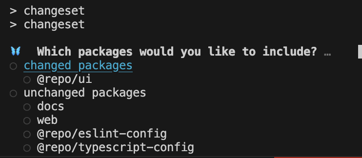
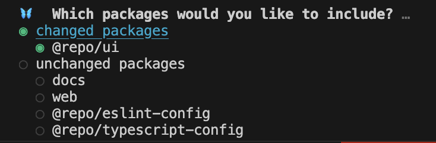
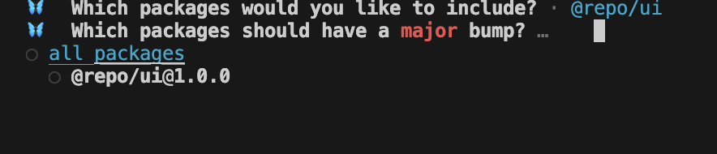
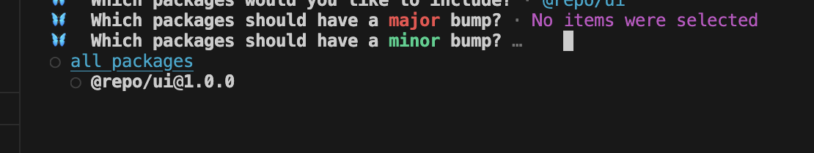
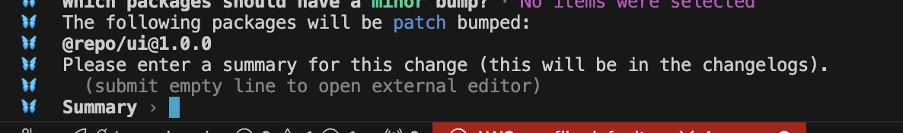
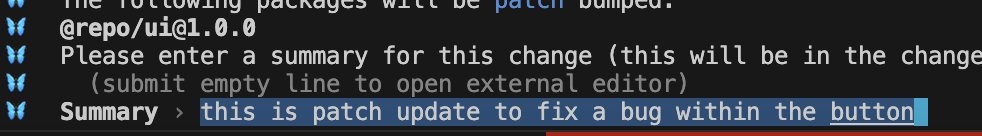
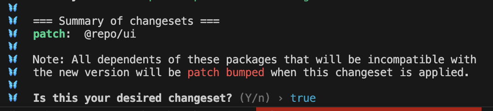

# Repo to demonstrate changeset and github actions

## This repo takes an approach of a single version for all UI packages

### TESTING:

1. Clone the repo:
```shell
  git clone git@github.com:shanefitzgerald/singlePackage.git
```
2. Create a new branch for a bugfix on the button component:
```shell
  git checkout -b "bugfix(button)-fixes-bug-in-button"
```
3. Change button component:
```js
  onClick={() => alert(`Hello from your ${appName} app! v${version} fixed bug`)}
```
to
```js
  onClick={() => alert(`Hello from your ${appName} app! v${version}`)}
```
4. Commit changes:
```shell
  git add .
  git commit -m "fixes bug in button component"
```
5. Run changeset bot locally:
```shell
  npm run changeset
```
6. Choose changeset changes <br/> <br />

7. Select changeset changes <br/> <br />

8. Select your semver bump:
   1. Major <br /> <br /> 

   1. Minor <br /> <br />

   1. Patch <br /> <br />

9. Add summary: <br /> <br />

10. Confirm summary: <br /> <br />

11. Add changeset markdown files generated
```shell
git add \*.md
```
12. Commit:
```shell
git commit -m "updates the button component to fix bug"
```
13. Push to repo:
```shell
git push --set-upstream origin "bugfix(card)-fixes-bug-in-card"
```
14. Open PR
15. Code Review
16. Merge PR
17. Upon merge, a github action will check for changeset markdown files.  If it finds a changeset markdown file it will open a Release PR
18. Leave this PR open (LOCK IT?) until we are ready to release.  If another PR is opened that fixes a bug in the card component, once it is merged, the github action will take the new fix, apply the correct version and ADD to the release PR currently open.
19. When it's time to release, merge the release PR
    // TODO set up the release GH action to kick off on this PR merge